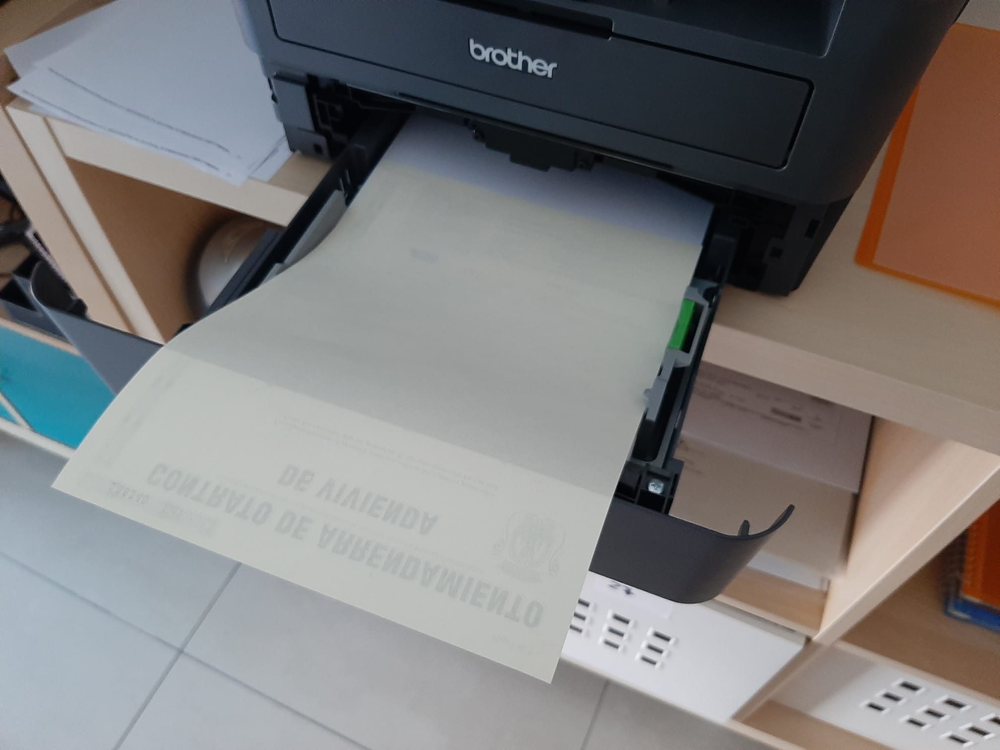

# Pasos Crear nuevo Modelo Contrato

1. Escanear nuevo modelo Contrato y guardar en carpeta PreviousFormPDF/fondos.
2. Crear nuevo documento en blanco tamaño A4 con Adobe Acrobat Pro DC.
3. Añadir background en EditarPDF, Fondo, elegimos el fondo de PreviousFormPDF/fondos y desactivamos el checkBox de Escala relativa a la página de destino (ajuste bien el tamaño del fondo al A4).
4. Añadir formulario en preparar formulario, añadimos los campos con sus nombres,fondo y borde transparente.
5. Una vez añadido los campos, quitamos el fondo (si no se quita normal, editar seleccionar como objeto y borrar con la opción reconocer texto deseleccionada), y guardamos como pdf en FormPDF.
6. Creamos nueva clase Java Generador que popule los TextBox.
7. Al generar desde la aplicación un pdf, usa el pdf sin fondo y con campos de formulario y popula los datos, este pdf se guarda temporalmente y se abre.
8. Imprimir como ajustes pdf: tamaño real, impresora... => ajustes impresora (quitar doble cara, dar imprimir, imprimir)
9. Colocar contrato en la impresora de la siguiente manera.

 

	

